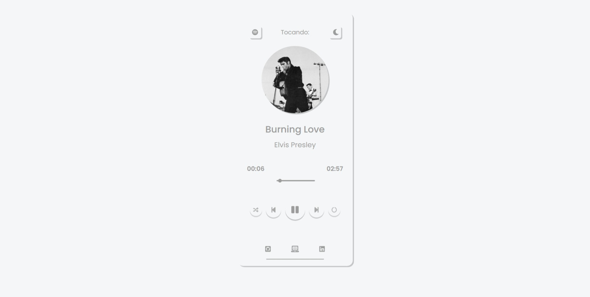
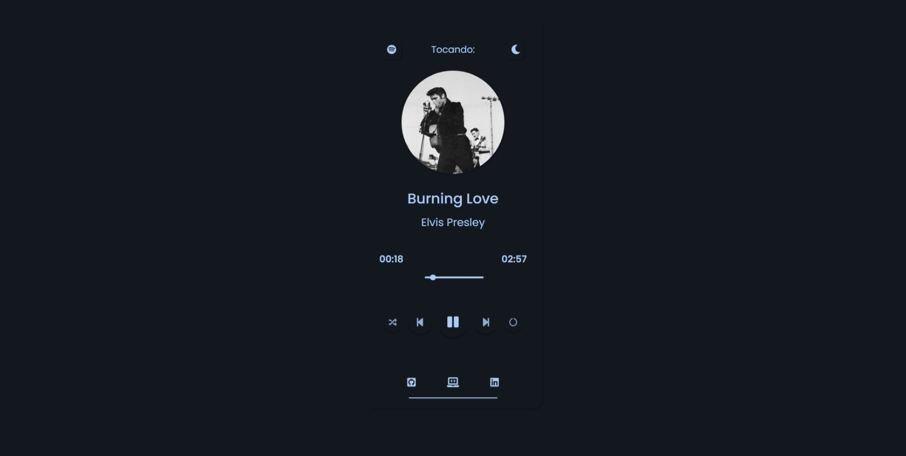

<h1 align="center">🎶 Player de Música</h1>

  <strong>App desenvolvido como forma de estudo</strong>
   
  Criado aplicativo de player de música, com minhas músicas favoritas de alguns artistas dos anos 70/80/90

  

  

### 💻 Site 

- <strong>[Music Player](https://music-app-player.netlify.app/)</strong>

## 🚀 Tecnologias

- HTML
- CSS
- JavaScript
